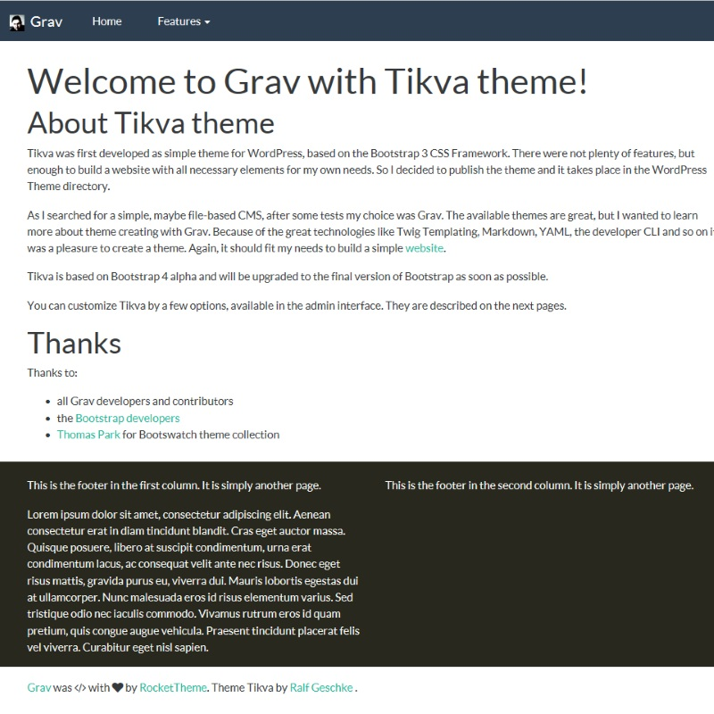

# Tikva

The **Tikva** Theme is for [Grav CMS](http://github.com/getgrav/grav).  Tikva is a minimalistic Grav theme, based on Bootstrap 4 framework.

# Installation

Installing the Tikva theme can be done in one of two ways. Our GPM (Grav Package Manager) installation method enables you to quickly and easily install the theme with a simple terminal command, while the manual method enables you to do so via a zip file. 

The theme is designed to be used to provide a documentation site. You can see this in action at 

## GPM Installation (Preferred)

The simplest way to install this theme is via the [Grav Package Manager (GPM)](http://learn.getgrav.org/advanced/grav-gpm) through your system's Terminal (also called the command line).  From the root of your Grav install type:

    bin/gpm install Tikva

This will install the Tikva theme into your `/user/themes` directory within Grav. Its files can be found under `/your/site/grav/user/themes/tikva`.

## Manual Installation

To install this theme, just download the zip version of this repository and unzip it under `/your/site/grav/user/themes`. Then, rename the folder to `tikva`. You can find these files either on [GitHub](https://github.com/geschke/grav-theme-tikva) or via [GetGrav.org](http://getgrav.org/downloads/themes).

You should now have all the theme files under

    /your/site/grav/user/themes/tikva

>> NOTE: This theme is a modular component for Grav which requires the [Grav](http://github.com/getgrav/grav), [Error](https://github.com/getgrav/grav-theme-error) and [Problems](https://github.com/getgrav/grav-plugin-problems) plugins.

# Updating

As development for the Tikva theme continues, new versions may become available that add additional features and functionality, improve compatibility with newer Grav releases, and generally provide a better user experience. Updating Tikva is easy, and can be done through Grav's GPM system, as well as manually.

## GPM Update (Preferred)

The simplest way to update this theme is via the [Grav Package Manager (GPM)](http://learn.getgrav.org/advanced/grav-gpm). You can do this with this by navigating to the root directory of your Grav install using your system's Terminal (also called command line) and typing the following:

    bin/gpm update tikva

This command will check your Grav install to see if your Tikva theme is due for an update. If a newer release is found, you will be asked whether or not you wish to update. To continue, type `y` and hit enter. The theme will automatically update and clear Grav's cache.

## Manual Update

Manually updating Tikva is pretty simple. Here is what you will need to do to get this done:

* Delete the `your/site/user/themes/tikva` directory.
* Download the new version of the Tikva theme from either [GitHub](https://github.com/geschke/grav-theme-tikva) or [GetGrav.org](http://getgrav.org/downloads/themes#extras).
* Unzip the zip file in `your/site/user/themes` and rename the resulting folder to `Tikva`.
* Clear the Grav cache. The simplest way to do this is by going to the root Grav directory in terminal and typing `bin/grav clear-cache`.

> Note: Any changes you have made to any of the files listed under this directory will also be removed and replaced by the new set. Any files located elsewhere (for example a YAML settings file placed in `user/config/themes`) will remain intact.

## Features

* Preinstalled [Bootswatch|(https://bootswatch.com/) Bootstrap 4 themes 
* Lightweight and minimal for optimal performance

## Setup

If you want to set Tikva as the default theme, you can do so by following these steps:

* Navigate to `/your/site/grav/user/config`.
* Open the **system.yaml** file.
* Change the `theme:` setting to `theme: tikva`.
* Save your changes.
* Clear the Grav cache. The simplest way to do this is by going to the root Grav directory in Terminal and typing `bin/grav clear-cache`.

Once this is done, you should be able to see the new theme on the frontend. Keep in mind any customizations made to the previous theme will not be reflected as all of the theme and templating information is now being pulled from the **tikva** folder.

## Configuration options

You can reach all configuration options in the admin interface, so it's recommended
to use it. 

### Footer support

Most websites need a special area at the bottom with common contents - the footer. 
The Tikva theme supports this in a flexible, but simple manner. In the admin interface (or by the option "footer.columns") you can set the number of columns the footer should have. 
Due to Bootstrap's grid system you can choose between 1, 2, 3, 4 or 6 columns.

Every column is represented by a special page, so the content can be edited with the usual interfaces (or with the help of a text/markdown editor). 

The simplest way to create the footer is to use the admin user interface. 

At first, create a folder named "footer" in the page area.

The name is important, so please use the folder name "footer". 
This folder must not be publish, so please switch the "published" option to "no" and save the page. 

At last, create the content area pages. 

As parent page use the previously created "footer" folder. The page template should be "footer". 
After finished you can edit the footer sections in the same manner as you edit pages. 

### Predefined themes

Tikva offers 25 themes! Most of them originate in [Bootswatch](https://bootswatch.com/) by Thomas Park. But you can also customize header and footer settings by the following options.

* navbar.invert: true/false - Invert navigation bar. This changes the text color. 
* navbar.background: Choose between seven options, in Bootstrap they are described as ".bg- * utils". 
* navbar.background_color: If the previous option is not enough, you can pick your own color. 
* footer.color_fg: Choose the foreground, i.e. text color used in the footer. 
* footer.color_bg: Choose the background color used in the footer. 

### Miscellaneous Settings

* theme.adjust_header: Adjust header by adding a distance between navigation and content. Some of the styles need more space, so you can use this option to adjust. As an example, to add 20 pixel, enter "20", the value has to be numeric. 

* dropdown.enabled: true/false - show dropdown links in navigation 
* theme.file_logo: Logo image in header. 
* favicon_file: Change the favicon by uploading your own. 

Both image files have to be stored in a folder in _user/pages/images/_:

* subfooter.enabled: true/false: Show the content below the footer.
* subfooter.content: This is the content of the subfooter area. The default value is a hint to Grav CMS and the theme, but you can modify the content fitting your needs. 

## Thanks

* all Grav developers and contributors
* the [Bootstrap developers](https://github.com/orgs/twbs/people)
* [Thomas Park](http://thomaspark.co/) for Bootswatch theme collection
